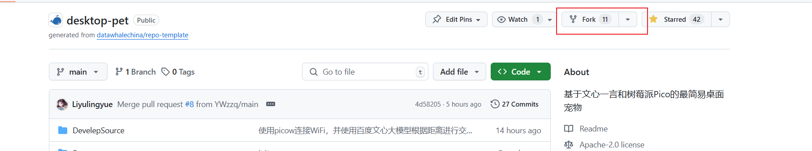
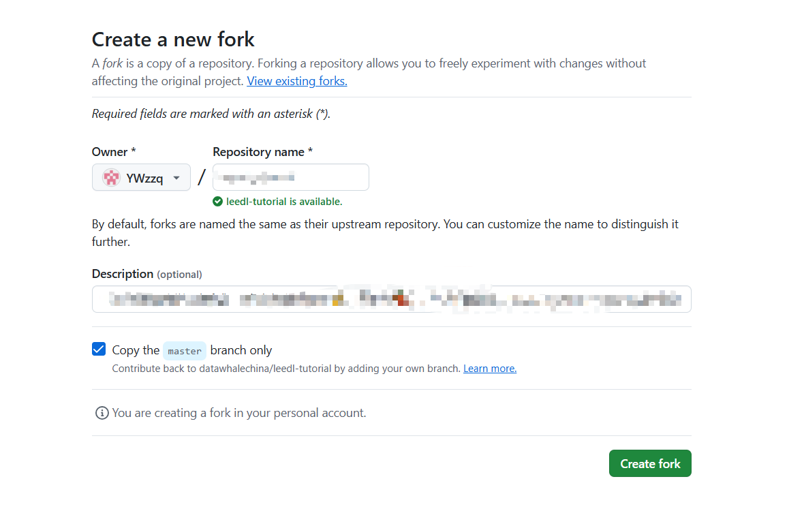
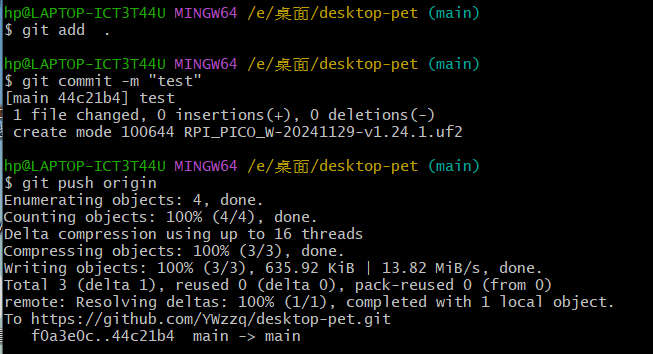
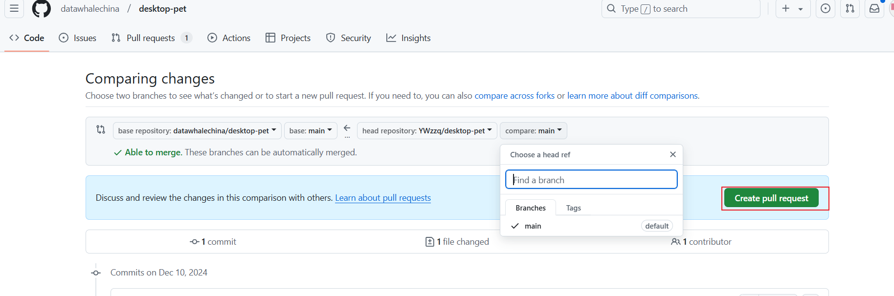
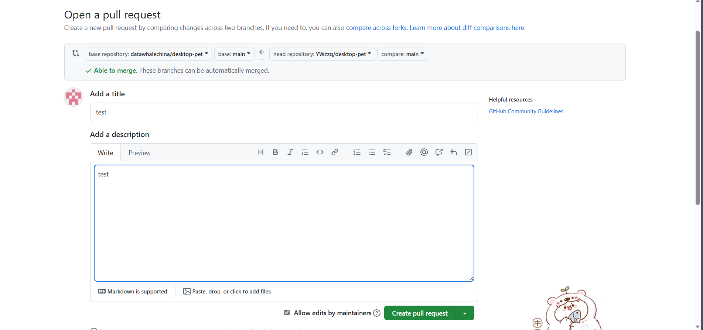

# 如何提交 Pull Request (PR)

本教程将指导您如何向项目提交 Pull Request。
可以直接看b站教程：https://m.bilibili.com/video/BV1bd4y1J7Vt?buvid=Z24570287D64E3284EBAB5BE2E5014813B79&from_spmid=search.search-result.0.0&is_story_h5=false&mid=dIsnDLLlq60mfRQRpM21kg%3D%3D&p=1&plat_id=114&share_from=ugc&share_medium=iphone&share_plat=ios&share_session_id=D36604F7-47AE-41A7-AFB3-9A1D24BA7C0E&share_source=WEIXIN&share_tag=s_i&spmid=united.player-video-detail.0.0&timestamp=1733797115&unique_k=oExJeQT&up_id=1643462710
## 1. 准备工作

1. 确保有 GitHub 账号
2. Fork 本项目到您的 GitHub 账户，如下
   
   
3. 创建之后，去右上角点击头像，点击进入你的仓库，点进去刚刚创建的仓库，如下
   
3. 点击code，复制链接，如下
   
4. 克隆项目到本地（先下载git，然后进入一个文件夹，右键打开git bash，输入git clone 刚刚复制的链接）：
   ```bash
   git clone 刚刚复制的链接
   ```
## 2. 创建分支并修改

1. 创建并切换到新分支（非必须，也可在主分支修改，忽略此步骤）：
   git checkout -b feature/your-feature-name
2. 在新分支上修改代码
3. 提交更改：（add . 是添加所有更改，可以add 文件名，是添加某个文件的更改）
   ```bash
   git add .
   git commit -m "描述你的更改"
   ```
4. 推送到 GitHub：（没有创建第一步，直接push 到主分支 git push origin）
   ```bash
   git push origin feature/your-feature-name
   ```

## 3. 提交 Pull Request

1. 在 GitHub 上打开你 fork 的仓库
2. 点击 "Pull requests" → "New pull request"
   
3. 选择分支：
   - base: 原项目的主分支
   - compare: 你的分支
   
4. 填写 PR 信息：
   - 标题：简述更改内容
   - 描述：详细说明更改原因和影响
   
5. 点击 "Create pull request"

## 4. 后续工作

1. 等待维护者审查
2. 根据反馈进行修改
3. 及时回复评论

#！！！！！！！！！！！
给仓库做一些优化（包括但不限于新增指引、文档错误优化、新增功能），可以从datawhale兑换一些小周边~
详见：https://github.com/datawhalechina/DOPMC/blob/main/REWARD.md
https://datawhaler.feishu.cn/sheets/SVZAsVwTWhdqJAtMHxjcuwVJnPf?sheet=e59157