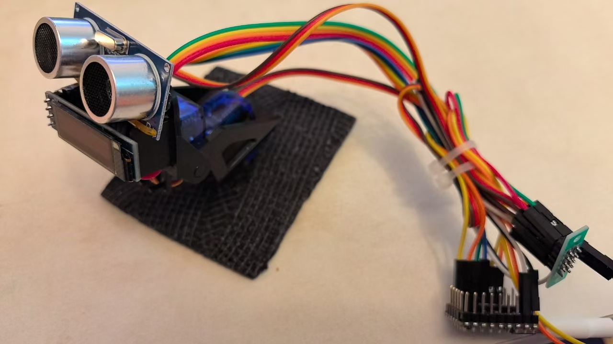
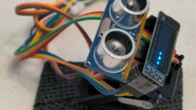

# 基于树莓派Pico的简易桌面宠物

> 本项目为了更好地进行展示，正在进行施工，可能会导致各个文档和代码不匹配。欢迎随时提ISSUE，作者可能会随时摆烂，欢迎随时push。

本项目介绍了如何通过树莓派Pico和一些简单的硬件设备，搭建一个简易的桌面宠物。该项目旨在通过树莓派Pico的简易桌面宠物，提供一个入门级的硬件编程和嵌入式系统开发的实践指引。

本项目的最低开发成本为50元人民币左右，示例如下所示。通过UWB口连接电脑，当你输入信息的时候，屏幕上会显示颜文字，并配合一些动作。

除此之外，你也可以再外接一个感知设备，如下图所示，增加了一个雷达测距工具（硬件成本仅增加了3块多），从而你可以通过硬件传感器感知周围的状态，并反馈给电脑。但这会导致代码逻辑非常复杂，所以本文会同时介绍如何无雷达和有雷达的两种情况。如果你对这一切都不熟悉，可以仅关注不包含雷达的版本，作为你的新手入门。

不加载雷达时，仅能通过电脑端交互，加载雷达后，可以基于你的手指动作进行交互~示例如下：

安装流程详见docs文档，如果在安装过程中出现疑问，请移步install-tips（强烈建议先看一遍再里面的注意事项再来进行连线和舵机安装！）

## 快速开始

进入 docs 目录，查看项目文档。

## 项目文件结构

本项目的目录结构与内容如下所示，你可以在每个文件夹下找到对应的 README.md 文件，以获取更多信息。例如 Docs 目录下的 README.md 文件包含了当前目录中所有文档的内容介绍。

- Codes: 存放项目代码，你可以从这里获取你需要的所有资源。
  - LowerMachine：存放用于下位机（树莓派Pico）的代码
  - UpperMachine：存放用于上位机（电脑端）的代码
- Docs: 存放项目文档

## 参与贡献

- 如果你想参与到项目中来欢迎查看项目的 [Issue]() 查看没有被分配的任务。
- 如果你发现了一些问题，欢迎在 [Issue]() 中进行反馈🐛。
- 如果你对本项目感兴趣想要参与进来可以通过 [Discussion]() 进行交流💬。

如果你对 Datawhale 很感兴趣并想要发起一个新的项目，欢迎查看 [Datawhale 贡献指南](https://github.com/datawhalechina/DOPMC#%E4%B8%BA-datawhale-%E5%81%9A%E5%87%BA%E8%B4%A1%E7%8C%AE)。

## 贡献者名单

| 姓名 | 职责 | 简介 |
| :----| :---- | :---- |
| Liyulingyue | 项目负责人 | 一个擅长烂尾的开发者 |

## 关注我们

扫描下方二维码关注公众号：Datawhale

