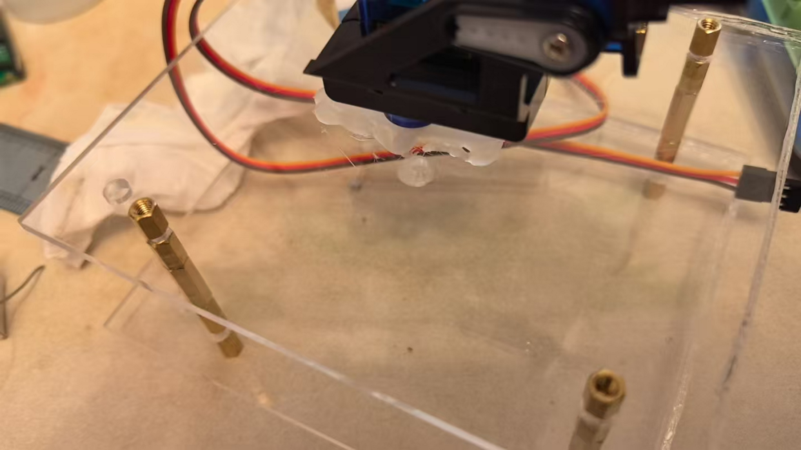
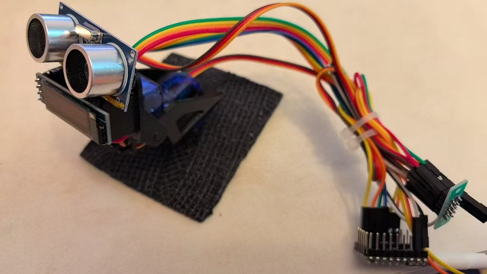

# 安装舵机注意事项
1.根据视频安装底座，底座需提前裁剪  
2.检查舵机一是否能丝滑转动，若一卡一卡的，询问商家是否损坏  
3.安装舵机1的外壳，注意，舵机1的线应朝向屁股位置，想象不出就仔细看视频（装反应该没什么影响，就是有损美观）  
4.安装舵机2，注意，后续需要装入旋臂，所以推荐钉子先别拧死，留出一定间隙，等旋臂装完后再把钉子拧死（另，如果这样干，后面拧钉子的位置会比较尴尬，又由于孔位第一次拧要费很大力气，所以这样做装上旋臂后拧钉子比较费劲），所以，先把钉子拧到底，然后松开部分，安装旋臂，拧紧钉子  
5.安装旋臂上的旋钮，这个旋钮也要处理，我建议力气小的拿刀一点点切  
6.用钉子把舵机1的外壳拧死（这就是为什么我建议检查舵机1是否损坏的原因，因为我重装了一次，甚至我需要再装一次，但要等几天后）  
7.恭喜你，安装完了舵机  
8.小彩蛋，你可以不装底座，像作者那样将十字形的塑料直接粘在某个地方（一定考虑好再粘）  
  
# 插线注意事项  
1.插线前先看看板子上的插口，尝试与作者所罗列表格一一对应，引脚n对应GPn（n是数字），GND是接地线（0V），5V输出是VBVS（或者用VSYS）  
2.2排×5P杜邦线排针板指一个板子，只不过它是一排正极，一排负极，且每一排有五个孔（别问我为什么知道，问就是用了五个板子，会导致除了板子其它设备都没电）  
3.舵机的红色线是正极，棕色线是负极（接到排针板上），橙色线是信号线（接到pico上）  
4.注意杜邦线的使用，别傻乎乎用胶带缠住两个针（这个我真没干，但是我能想到有人可能想这么干）  
5.LED和超声波测距布局参考作者成品  
  
